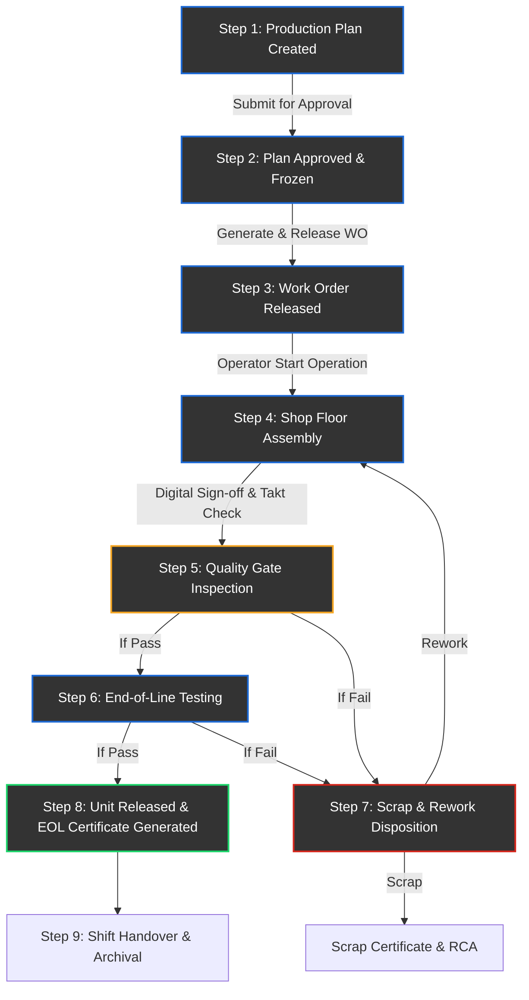

# AutoMFG — End-to-End Workflow & System Architecture

This document details the step-by-step sequence, roles, and database tables involved in the lifecycle of the **AutoMFG** Manufacturing Execution System (MES) application.

---

## 👥 Roles & Responsibilities (RBAC)

The system utilizes Role-Based Access Control (RBAC) to enforce security and division of labor on the shop floor. Below is a mapping of roles to their primary responsibilities and module permissions:

| Role | Role Identifier | Primary Modules & Permissions |
| :--- | :--- | :--- |
| **System Admin** | `sys_admin` | All modules, Admin Panel (RBAC, Audit Logs, Settings). |
| **Plant Manager** | `plant_manager` | All modules (Read/Write), shift reports, quality escalations, OEE tracking. |
| **Production Manager**| `production_manager` | Plan approvals, work order release, shift handovers, OEE tracking, quality gates. |
| **Production Planner**| `production_planner` | Draft master plans, check material availability, manage work orders, OEE. |
| **Shift Supervisor** | `shift_supervisor` | Shop floor operations, Andon resolution, tool checks, maintenance tickets, shift handovers. |
| **Line Leader** | `line_leader` | Work order progression, tool assignments, local defect logging. |
| **Machine Operator** | `machine_operator` | Operation start/sign-off, Takt timing, raise Andon alerts, log local maintenance issues. |
| **Quality Inspector** | `quality_inspector` | Quality inspections, logging defects, disposition (scrap/rework), EOL functional tests. |
| **Maintenance Tech** | `maintenance_tech` | Repair breakdowns, diagnose machine faults, spares request, tool calibration. |

---

## 🔄 Lifecycle of a Production Unit

The end-to-end manufacturing process follows a strict linear sequence, integrating state changes across React components, Zustand stores, and Supabase database tables.

---

## 📋 Step-by-Step Sequence & Operations

### Step 1: Production Planning
* **Primary Role**: `production_planner`
* **Trigger Component**: `ProductionPlanning.jsx`
* **Database Tables**: `production_plans`, `capacity_checks`, `material_availability_checks`
* **Sequence**:
  1. The Planner inputs a new part number (e.g. `BMW-M4-DOOR-LH`), production line, quantity, and planned date range.
  2. The system checks capacity constraints (`capacity_checks`) and schedules material verification (`material_availability_checks`).
  3. The plan is saved in `draft` status.
  4. The Planner submits the plan, which changes its status to `pending_approval`.

> [!NOTE]
> Plans are visually displayed on an interactive Gantt chart (`GanttChart` component) indicating scheduling overlaps across lines.

---

### Step 2: Plan Approval & Freezing
* **Primary Role**: `production_manager` or `plant_manager`
* **Trigger Component**: `ProductionPlanning.jsx` (Approve/Reject Actions)
* **Database Tables**: `plan_approvals`, `production_plans`
* **Sequence**:
  1. The Manager reviews pending plans.
  2. Clicking **Approve** inserts a record into `plan_approvals` and transitions the plan's status to `approved`.
  3. The plan is subsequently advanced to `frozen` to lock scheduling and allow work order generation.

---

### Step 3: Work Order Release
* **Primary Role**: `production_planner` or `production_manager`
* **Trigger Component**: `WorkOrders.jsx`
* **Database Tables**: `work_orders`, `vin_units`, `material_issues`
* **Sequence**:
  1. Work orders are generated based on the frozen plan's VIN range and quantities, initialized in `created` status.
  2. The supervisor advances the Work Order to `released`, which allocates inventory (`material_issues`) and schedules the routing steps.
  3. When operators pull the order at their stations, it moves into `in_progress`.

---

### Step 4: Shop Floor Assembly & Execution
* **Primary Role**: `machine_operator`
* **Trigger Component**: `AssemblyLine.jsx` (Station View)
* **Database Tables**: `operation_records`, `takt_events`
* **Sequence**:
  1. The operator selects the active `in_progress` Work Order at their station.
  2. The operator clicks **Start Operation**, inserting a record into `operation_records` with a start timestamp, starting the **Takt Timer** (set to a standard of 60 seconds per unit).
  3. If cycle time exceeds the standard, a `takt_events` row is written with `overrun_flag = true`, highlighting bottlenecks.

---

### Step 5: Andon Alert Response (Emergency Interrupt)
* **Primary Role**: `machine_operator` (Raises), `shift_supervisor` (Resolves)
* **Trigger Component**: `AssemblyLine.jsx` (Andon Board/Modal)
* **Database Tables**: `andon_events`, `issue_resolutions`, `notifications`
* **Sequence**:
  1. In case of issues (part shortage, safety concern, machine breakdown, quality defect), the operator clicks **Raise Andon**.
  2. An `andon_events` row is inserted in `open` state, displaying a high-visibility red warning banner across all dashboards using Supabase Realtime subscriptions.
  3. The supervisor diagnoses the issue, logs corrective actions into `issue_resolutions`, and clicks **Resolve**, clearing the alert.

---

### Step 6: Quality Gate Inspection
* **Primary Role**: `quality_inspector`
* **Trigger Component**: `QualityGate.jsx`
* **Database Tables**: `quality_inspections`, `inspection_checks`, `batch_holds`, `defect_records`
* **Sequence**:
  1. After assembly, the unit is measured at the Quality Gate.
  2. The Inspector inputs measurements against Upper/Lower Specification Limits (USL/LSL).
  3. **PASS**: If in spec, a pass is logged in `quality_inspections`.
  4. **FAIL**: If out of spec, the result is flagged as `fail`, and a `batch_holds` entry is automatically generated to lock the VIN from downstream operations. The Inspector also logs a `defect_records` entry to capture the defect details.

---

### Step 7: Scrap & Rework Loop
* **Primary Role**: `quality_inspector`, `shift_supervisor`, `production_manager`
* **Trigger Component**: `ScrapRework.jsx`
* **Database Tables**: `defect_records`, `rework_orders`, `scrap_certificates`, `root_cause_analyses`, `corrective_actions`
* **Sequence**:
  1. For defects logged in the Defect Register, the supervisor updates the disposition:
     - **Rework**: Generates a `rework_orders` entry. An operator is assigned to perform repairs. Once complete, the unit returns to the Quality Gate.
     - **Scrap**: The unit is decommissioned. A cost impact is calculated and written to `scrap_certificates`. A **Scrap Certificate** is made downloadable as a PDF.
     - **UAI (Use-As-Is)**: Sends a digital waiver to the Quality Manager (`uai_approvals` table) if the defect is cosmetic and out of critical path.
  2. The quality team conducts a Root Cause Analysis (RCA) via the **RCA Tracker** (using 5-Why or Ishikawa tools), logging entries in `root_cause_analyses` and assigning long-term preventions to owners in `corrective_actions`.

---

### Step 8: End-of-Line (EOL) Testing & Release
* **Primary Role**: `quality_inspector`
* **Trigger Component**: `EOLTesting.jsx`
* **Database Tables**: `eol_test_runs`, `eol_test_results`, `eol_certificates`, `vin_units`
* **Sequence**:
  1. The inspector enters the unit's VIN to verify its existence.
  2. The inspector inputs measurements for 6 functional tests (Engine, Brakes, Lights, Dimensions, ECU, Water Ingress).
  3. If all tests meet criteria:
     - The run is saved as `pass` in `eol_test_runs`.
     - The unit status in `vin_units` is updated to `released`.
     - A certificate ID is written to `eol_certificates` and the final **End-of-Line Test Certificate** is rendered as a PDF download for delivery.
  4. If any test fails, the run is saved as `fail` and the unit is routed back to rework.

---

### Step 9: Shift Handover & End-of-Shift Summary
* **Primary Role**: `shift_supervisor`
* **Trigger Component**: `ShiftHandover.jsx`
* **Database Tables**: `shift_handover_reports`, `carry_forward_tasks`, `end_of_shift_summaries`
* **Sequence**:
  1. At the end of the shift, the outgoing supervisor records output statistics (planned vs. actual, downtime, safety issues, scrap count) in `shift_handover_reports`.
  2. Unresolved shop floor issues are listed and auto-converted into `carry_forward_tasks` assigned to the incoming shift.
  3. The system computes the shift statistics, creating an entry in `end_of_shift_summaries`.
  4. The incoming supervisor reviews the handover report and clicks **Sign Off**, transitioning the status from `pending` to `signed_off`.

---

## 🛠 Supporting Systems & Infrastructure

### Maintenance (Maint. Tech)
* **Component**: `Maintenance.jsx`
* **Database Tables**: `breakdown_tickets`, `maintenance_diagnoses`, `spare_parts_requests`, `repair_activities`, `trial_runs`
* **Role**: When a machine status changes to `breakdown` (e.g. Press Machine P1), a ticket is logged. Maintenance technicians acknowledge it, perform repair activities, log used spare parts, execute trial runs, and close the ticket. This calculates MTBF (Mean Time Between Failures) and MTTR (Mean Time To Repair).

### Tooling (Line Leaders & Techs)
* **Component**: `Tooling.jsx`
* **Database Tables**: `tools`, `tool_replacement_requests`, `calibration_records`
* **Role**: Tracks active cycle counts against the maximum life of assembly line tools. Technicians upload tool calibration certificates (`calibration_records`) and request tool replacements when warning or critical cycles are reached.

### OEE Dashboard (Plant Manager & Planners)
* **Component**: `OEEDashboard.jsx`
* **Database Tables**: `oee_kpis`, `production_kpis`
* **Role**: Displays plant metrics (Availability, Performance, and Quality) in real-time. Recharts are used to show line productivity, First Pass Yield (FPY), and schedule adherence.
