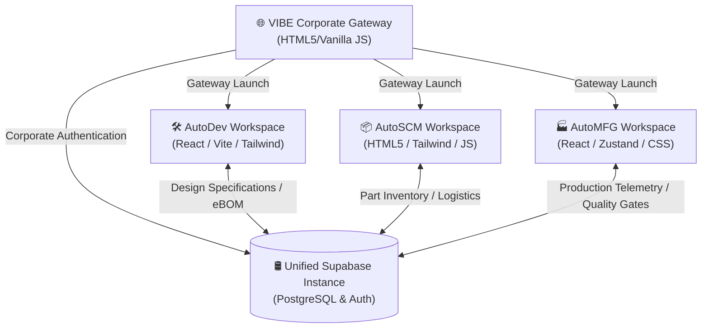

# 🏎️ VIBE Enterprise Portal
> **The High-Performance Digital Core for Next-Generation Electric & Autonomous Vehicles.**

The VIBE Enterprise Portal is a unified, end-to-end industrial software suite built to power the lifecycle of high-performance electric vehicles (EVs). From aerodynamically optimized vehicle concepts to multi-plant assembly line telemetry, the platform integrates three distinct specialized sub-applications under a single corporate gateway.

---

## 📊 Executive Overview

The system bridges engineering, supply chain, and production operations, ensuring data consistency across all divisions:



---

## 📂 Workspace Modules

### 1. 🌐 VIBE Corporate Gateway (Landing Suite)
* **Purpose**: Serves as the primary public entry point and secure staff authentication hub.
* **Key Features**:
  * **Vehicle Catalog**: Sleek interfaces showcasing the flagship models: **Horizon** (luxury touring), **Echelon** (aerodynamic utility), and **Apex** (track-oriented performance).
  * **Legal & Compliance**: Full clickwrap legal consent flows for test drives, support, and careers.
  * **Unified Login**: A clean, credential-free login modal directing staff automatically to their respective dashboard portals.

### 2. 🛠️ AutoDev (Engineering & Design)
* **Purpose**: The R&D command center for designers, program managers, and validation engineers.
* **Key Features**:
  * **CAD Model Management**: Revision tracking for battery packaging, suspension geometry, and chassis assemblies.
  * **eBOM (electronic Bill of Materials)**: Part parent-child hierarchies, unit costs, and lifecycle states (Draft, Released, Obsolete).
  * **ECO (Engineering Change Orders)**: Collaborative voting and approval flows for vehicle design modifications.
  * **Validation & DVP&R**: Pass/fail telemetry for crash testing, aerodynamics simulation, and thermal loops.

### 3. 📦 AutoSCM (Supply Chain & Logistics)
* **Purpose**: The procurement engine managing global parts acquisition and transit.
* **Key Features**:
  * **Supplier Dashboard**: Performance metrics, onboarding statuses, and transaction histories.
  * **Logistics & Shipments**: Real-time interactive tracking of cargo transit routes and component ETAs.
  * **Inventory Management**: Warehouse capacities, stock levels, and safety reorder alerts.

### 4. 🏭 AutoMFG (Manufacturing Execution System)
* **Purpose**: The assembly line shop-floor controller and production monitoring system.
* **Key Features**:
  * **OEE Dashboard**: Real-time telemetry tracking Availability, Performance, Quality, and overall equipment effectiveness.
  * **Assembly Line Controls**: Line speed controls, status tracking (Active, Down, Blocked), and incident logs.
  * **Quality Gate & EOL (End of Line)**: Digital inspection logs for final battery, drivetrain, and electronics testing.
  * **Shift Handovers**: Digital logbook transfers between shift supervisors to maintain continuous uptime.

---

## ⚙️ Technical Specifications

| Component | Technology Stack | Key Libraries |
| :--- | :--- | :--- |
| **Database & Auth** | Supabase (PostgreSQL) | PostgREST API, JWT Authentication, Row-Level Security (RLS) |
| **Landing Suite** | HTML5, Vanilla CSS, JS | Supabase CDN, FontAwesome, Google Fonts (Orbitron/Inter) |
| **AutoDev** | React 18, Vite | Recharts, TailwindCSS, Lucide Icons |
| **AutoSCM** | HTML5, CSS3, Vanilla JS | TailwindCSS, ApexCharts |
| **AutoMFG** | React 18, Vite, Zustand | TailwindCSS, Recharts, Lucide Icons |

---

## 🚀 Installation & Local Development

### Prerequisites
* **Node.js** (v18 or higher recommended)
* **Git**

### 1. Repository Setup
Clone the repository and enter the directory:
```bash
git clone https://github.com/netseedvikrant/Vibe-Automotives.git
cd Vibe-Automotives
```

### 2. Environment Configuration
Create a `.env` file in the root directory:
```env
SUPABASE_URL="https://your-project-ref.supabase.co"
SUPABASE_ANON_KEY="your-anon-public-key"
```

Create an additional environment file for `autodev` at `autodev/.env`:
```env
VITE_SUPABASE_URL="https://your-project-ref.supabase.co"
VITE_SUPABASE_ANON_KEY="your-anon-public-key"
```

### 3. Launching the Portals (start_servers.bat)
The project includes a launcher script (`start_servers.bat`) on Windows to spin up the local development servers:
* **Option 1**: Starts the original consumer landing page on port `3001` (http://localhost:3001/).
* **Option 2**: Starts the dedicated, direct corporate staff login gateway on port `3002` (http://localhost:3002/).
* **Option 3**: Starts both servers simultaneously.

To start the launcher:
1. Double-click `start_servers.bat` or run it from your command line:
   ```cmd
   start_servers.bat
   ```
2. Select your desired hosting mode (1, 2, or 3) from the interactive menu.

Alternatively, you can run the servers manually using Python:
* **Original Landing Page (Port 3001)**:
  ```bash
  python3 -m http.server 3001
  ```
* **Direct Staff Portal (Port 3002)**:
  ```bash
  python3 server_3002.py
  ```

### 4. Running AutoDev (React App)
```bash
cd autodev
npm install
npm run dev
```

### 5. Running AutoMFG (React App)
```bash
cd AutoMFG/AutoMFG
npm install
npm run dev
```

### 6. Compiling AutoSCM (React App)
The AutoSCM workspace uses a compiled React environment. After making modifications to `app.jsx`, compile the browser bundle:
```bash
cd AutoSCM
npm install
npm run build
```

---

## 🔒 Security & Policy Architecture

* **Database Hardening**: Row-Level Security (RLS) is enabled on core system relations (`users`, `user_profiles`, `notifications`, etc.).
* **API Access Pattern**: Frontend operations utilize a secure, public `anon` key pattern for all read and write queries, respecting local table permissions and database constraints.
