# 🏎️ VIBE Enterprise: Database Entity Relationship (ER) Diagram

This document provides a technical overview of the unified backend schema powering the **VIBE Enterprise Portal**. It tracks the progression of an idea (Engineering Concept) into a physically manufactured product (Reality) via database records and relationships.

Consistent with database design practices, the entities are represented by their actual table structures (**posts/records**) rather than organizational roles, showing exactly how tables connect from conception, feasibility, design, procurement, prototyping, and manufacturing, to final shipment.

---

## 📊 Database Entity Relationship Diagram

```mermaid
erDiagram
    users {
        uuid id PK
        string full_name
        string email
        string role
        string plant_location
    }
    programs {
        uuid id PK
        string program_code UK
        string program_name
        integer current_gate
        string status
        uuid created_by FK
        uuid assigned_lead_engineer FK
    }
    feasibility_reviews {
        uuid id PK
        uuid program_id FK
        integer trl_level
        string technical_assessment
        string status
        uuid reviewed_by FK
    }
    trl_assessments {
        uuid id PK
        uuid program_id FK
        string category
        integer score
    }
    engineering_risks {
        uuid id PK
        uuid program_id FK
        string risk_title
        string impact_level
        string probability
        string status
    }
    apqp_gates {
        uuid id PK
        uuid program_id FK
        string gate_name
        integer gate_number
        string gate_status
        uuid approved_by FK
    }
    cad_files {
        uuid id PK
        uuid program_id FK
        string file_name
        string file_url
        string version
        string status
        uuid uploaded_by FK
    }
    ddr_reviews {
        uuid id PK
        uuid program_id FK
        uuid cad_file_id FK
        string title
        string status
    }
    ddr_assignments {
        uuid id PK
        uuid ddr_id FK
        uuid reviewer_id FK
        string role
        string status
    }
    ddr_comments {
        uuid id PK
        uuid ddr_id FK
        uuid cad_file_id FK
        uuid author_id FK
        uuid assigned_to FK
        string severity
        string status
    }
    design_corrections {
        uuid id PK
        uuid ddr_comment_id FK
        uuid design_engineer_id FK
        string status
        uuid new_cad_revision_id FK
    }
    ebom {
        uuid id PK
        uuid program_id FK
        string part_number
        string part_name
        integer quantity
        uuid supplier_id FK
        string status
    }
    purchase_requisitions {
        uuid id PK
        string title
        string department
        decimal estimated_cost
        string status
        string notes
    }
    suppliers {
        uuid id PK
        string name
        decimal rating
    }
    ppap_submissions {
        uuid id PK
        uuid program_id FK
        uuid supplier_id FK
        uuid part_id FK
        integer submission_level
        string status
    }
    prototype_builds {
        uuid id PK
        uuid program_id FK
        string build_phase
        integer quantity
        string status
    }
    validation_tests {
        uuid id PK
        uuid program_id FK
        uuid prototype_id FK
        string test_name
        string status
    }
    dvpr_records {
        uuid id PK
        uuid program_id FK
        uuid validation_id FK
        string result
    }
    work_orders {
        uuid id PK
        uuid program_id FK
        string line
        integer produced_qty
        integer scrap_qty
        string status
    }
    defect_records {
        uuid id PK
        uuid supplier_id FK
        uuid work_order_id FK
        integer qty
        string disposition
    }
    tools {
        uuid id PK
        string tool_name
        decimal life_percentage
    }
    shift_handovers {
        uuid id PK
        uuid outgoing_supervisor_id FK
        uuid incoming_supervisor_id FK
        integer actual_output
        integer scrap_count
    }
    eol_tests {
        string vin PK
        string model
        string overall_result
    }

    %% Relationships
    users ||--o{ programs : "creates"
    users ||--o{ programs : "leads"
    users ||--o{ feasibility_reviews : "reviews"
    users ||--o{ cad_files : "uploads"
    users ||--o{ ddr_assignments : "assigned_to"
    users ||--o{ ddr_comments : "authors"
    users ||--o{ ddr_comments : "assigned_engineer"
    users ||--o{ design_corrections : "implements"
    users ||--o{ ppap_submissions : "reviews"
    users ||--o{ shift_handovers : "hands_off"
    users ||--o{ shift_handovers : "takes_over"

    programs ||--o{ feasibility_reviews : "assessed_by"
    programs ||--o{ trl_assessments : "tracks_trl"
    programs ||--o{ engineering_risks : "logs_risks"
    programs ||--o{ apqp_gates : "milestoned_by"
    programs ||--o{ cad_files : "contains_cad"
    programs ||--o{ ddr_reviews : "reviews_design"
    programs ||--o{ ebom : "defines_bom"
    programs ||--o{ ppap_submissions : "validates_parts"
    programs ||--o{ prototype_builds : "schedules_builds"
    programs ||--o{ validation_tests : "executes_tests"
    programs ||--o{ dvpr_records : "links_requirements"
    programs ||--o{ work_orders : "schedules_production"

    cad_files ||--o{ ddr_reviews : "reviewed_in"
    cad_files ||--o{ ddr_comments : "referenced_by"
    cad_files ||--o{ design_corrections : "revised_as"

    ddr_reviews ||--o{ ddr_assignments : "assigns"
    ddr_reviews ||--o{ ddr_comments : "comments"

    ddr_comments ||--o{ design_corrections : "rectified_by"

    suppliers ||--o{ ebom : "provides"
    suppliers ||--o{ ppap_submissions : "submits_ppap"
    suppliers ||--o{ defect_records : "penalized_by"

    ebom ||--o{ ppap_submissions : "validated_via"
    ebom ||--o{ purchase_requisitions : "triggers_pr"

    prototype_builds ||--o{ validation_tests : "tested_via"
    validation_tests ||--o{ dvpr_records : "validates_against"

    work_orders ||--o{ defect_records : "logs_defects"
    tools ||--o{ purchase_requisitions : "triggers_replacement"
```

---

## 🔑 Data Lifecycle Progression (Idea to Reality)

### 1. Conception & Feasibility Phase
* **`programs`**: The central entity representing a new vehicle program (the "Idea"). Starts with status `Concept`.
* **`trl_assessments` & `engineering_risks`**: Tracks the technology readiness score (1-9) and risk factors before committing resources.
* **`feasibility_reviews`**: Lead Engineer assessment reports.
* **`apqp_gates`**: Multi-gate status tracker. Approvals (`Gate 0`) confirm design feasibility.

### 2. Design & Collaborative Engineering Phase
* **`cad_files`**: Houses revision metadata and cloud URLs for CAD models.
* **`ddr_reviews` / `ddr_assignments` / `ddr_comments`**: Review process where designers and engineers collaborate on feedback loops.
* **`design_corrections`**: Pinpoints fixes required on drawings/models. Links back to a corrected CAD file.

### 3. Sourcing & Supply Chain Phase
* **`ebom`**: The electronic Bill of Materials detailing final release parts, counts, and suppliers.
* **`purchase_requisitions`**: Auto-triggered from the `ebom` when Gate 1 (Design Freeze) is completed.
* **`suppliers` & `ppap_submissions`**: Governs supplier qualification and part validation (Level 1-5 submittals) before assembly lines begin.

### 4. Prototyping & Testing (ASPICE)
* **`prototype_builds`**: Schedules physical prototype phases (Mule, Alpha, Beta).
* **`validation_tests` & `dvpr_records`**: Executes crash, aerodynamic, and durability tests. The `check_aspice_compliance` trigger blocks Gate approvals if these tests do not reach `Passed`.

### 5. Shop Floor Production & Reality
* **`work_orders`**: Translates approved programs into assembly line orders.
* **`defect_records`**: Logs scraps/reworks. Triggers rating deductions on `suppliers` and generates CAPA alerts.
* **`tools`**: Monitors assembly tool wear. Autogenerates replacement requests (`purchase_requisitions`) when tool lifetime hits 95%.
* **`shift_handovers`**: Transfers operational statuses and pending events between supervisor shifts.
* **`eol_tests`**: Scans the completed vehicle's VIN and executes final electronic and drivetrain verification. Releasing the vehicle represents the **Reality**.
